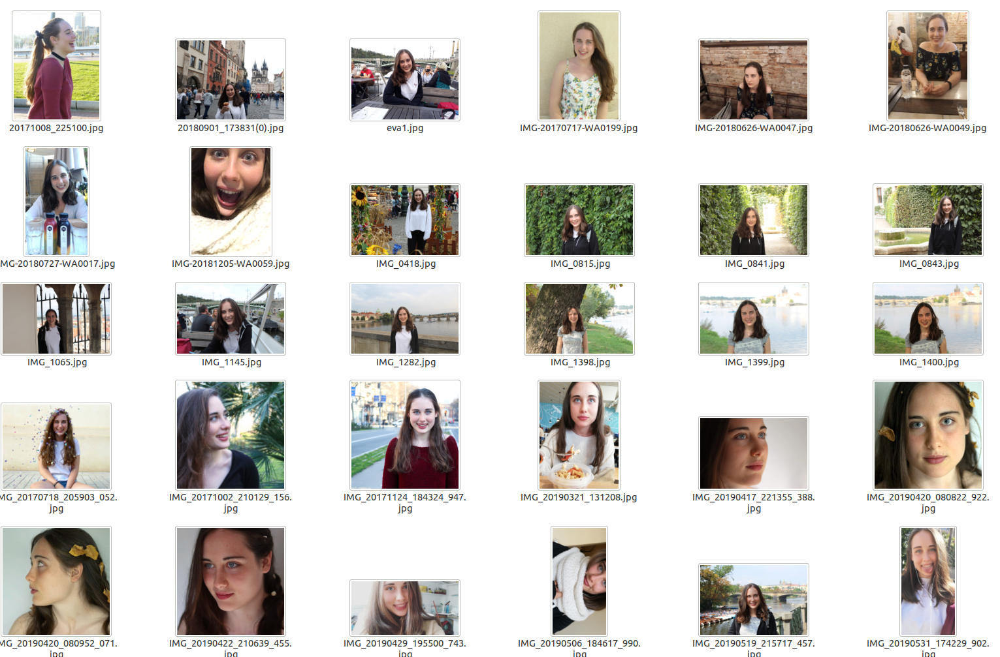
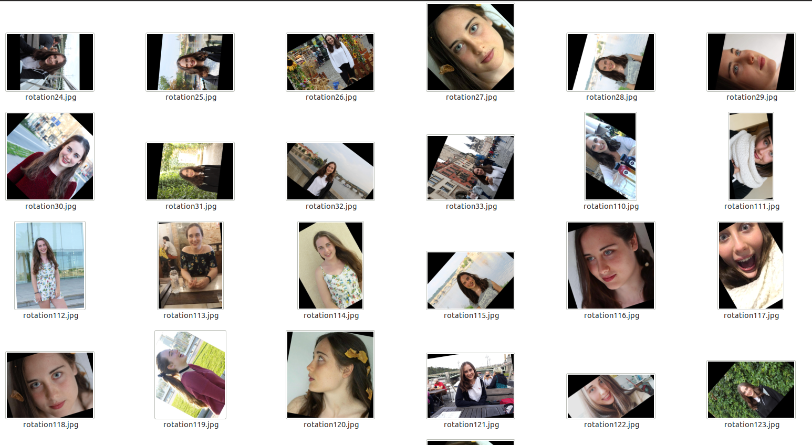
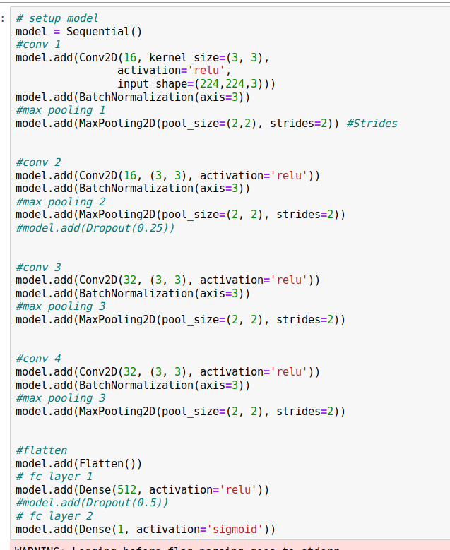
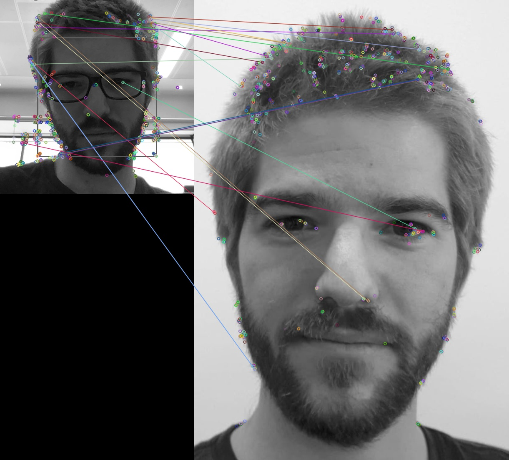

# Image Recognition Project
For this project we have decided to apply the knowledge of the BootCamp course on AI. We have mixed the Machine Learning models with computer vision. 
The main point is to find the most effective system to do personalized face recognition. Based on class understanding we have decided to compare four different systems.
  -CNN from scratch
  -Transfer Learning
  -ORB
  -YOLO
Our first impression is that YOLO probably is the one that is going to give us the best performance,due to the fact that is being used in many areas, even the fact that it is quite slow in the performance. In second place, or the one that probably also works really well is the Transfer Learning.

## Main Points of CNN and Transfer Learning:
### Pre-Processing
For this models we need to do a training with a large set of images but were able to recollect 34 so we should find a way to train more images, the best way to solve this was to do image aumentation, using three types of rotation, applying noise and mirror effect we were able to have 184 images.

### Model
#### CNN
##### Why?
We wanted to experiment with what we have learned at class and create our model from scratch. We did some research and we realised that the CNN were the best neural networks.
##### Problems we had
Once we did the model and trained it, even it was really good we realised that there was a problem; we were not able to detect more than one face at the same time, that was an issue that we needed to solve because for us was a huge drawback.
##### Conclusion
Even we did the model form scratch and our first impression was that probably we would not be able to have a good accuracy in the test set we achieve a 95%.
##### The CNN model and layers that we used were:

#### The transfer learning:
##### Why?
It is known that creating a CNN model from scratch is not as good as using one that is pre-trained and only needs to add the last layer to adapt it to the requirements of the project that you are developing, so being aware of it we decided to try if that was as good as they presented us, even we had achieved a really good accuracy with the CNN from scratch. The base model that we chosed was MobileNetV2.
##### Problems we had
When we started with this model we realised that we were going to have the same problem as before, the restriction of only being able to detect one person at time so we put some different last layers but in any case we achieved a accuracy as good as the case before so we decline to continue
#### Conclusion 
The idea of having a pre-trained models with his own filters is really good, but from our point of view it is an option that should be trained if the model that you develop from scratch does not have a good accuracy and you can not find any way to improve it.

#### HaarCascades

One of the most important things in face recognition system is detecting the faces in an image, one of the fastests systems actually is the HaarCascades, this method uses a technique called Histogram of Oriented Gradient (HOG). Basically it trains a cascade function (showed as a boxes of shapes) that learns the general patterns of a face (the attributes), through the change of colors, shapes and shadows. This system have arround 95% accuracy detecting faces. 

HaarCascades don't differenciate between faces but give us the posicion and shape to use later another system to estimate the id of the people.

Pros:
  - Is really fast identifying faces.
  - Low cpu consumption.
  - Returns the posicition and dimensions of all the screen faces.
 

Conts:
  - Can't differenciate between people.

#### ORB

Oriented FAST and Rotated BRIEF (ORB) was developed by OpenCV labs mainly as an free alternative of SOFT and SURF after being patented.
ORB performs better feature detection than SURF, almost two magnitude orders faster.

Basically starts by finding special regions in a given image called key points, that points are the highly distinctive locations.

We compare the image taked by the webcam with the image gived by us as a reference (my face).

The key points of ORB are the followings:
  - It have a good performance and low cost.
  - The learning method is based on one gived picture.
  - Can detect rotated and scaled figures.
  
Why we dindn't choosed ORB:
  - Is not the most acured system to detect faces.
  - This method compares interesting points of two images, if a face changes it can't detect the "evolution".
  - Sometimes detects parts of hair as a interesting points more than facial caracteristics.
  

### FINAL IDEA: CNN + HaarCascade
Once we tried to develop the four models we realised that non of them was good as we hoped, but thanks to all that we learned we could find a way to mix two of the main ideas that we used in the models and get a good result.
When we did the OBR we used the HardCascade as a previous step to detect the faces so we used this idea in the CNN model, so instead of detecting a face in a hole image we send the croped faces that the HardCascade had detected before. With this idea we can solve the problem of just one detecting.

While we were using this mixed idea we realised that we needed to train more images. What we tried while we were doing the first training was to have really different images, with different backgrounds, but now that the important thing are the faces because the input of the model is a cropped face we decided to train again the model just with faces. We used the HardCascasde to save the cropped images from a live webcam images and we played with different lights and positions. With that we achieved 560 images. Then we used again the image aumentation and we achieved a dataset of 3160 images for each of us.
